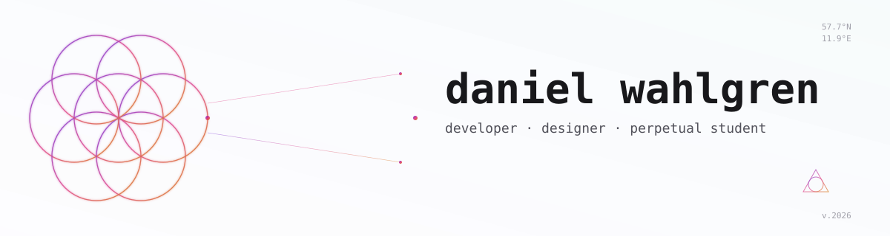

<picture>
  <source media="(prefers-color-scheme: dark)" srcset="./assets/header-dark.svg">
  <source media="(prefers-color-scheme: light)" srcset="./assets/header-light.svg">
  
</picture>

<br>

I build software the way I make images — composition first, then layer in the detail until it earns its place. Twenty years of graphics work taught me what *finished* looks like; the last few years of code taught me how to get there in a different medium.

Currently interning at [Hive & Five](https://hiveandfive.com/). Wrapping up a degree in object-oriented programming with AI competence at NBI/Handelsakademin (Gothenburg). Thesis project: predicting blood glucose from CGM data.

```
front of house    ·  React, TypeScript, considered UI, motion that means something
back of house     ·  FastAPI, Pydantic, Prisma, Postgres / Mongo, clean architecture
the in-between    ·  ML pipelines, RAG, agent systems, data engineering
```

### what i'm building →

Live work lives at **[wahdanz.vercel.app](https://wahdanz.vercel.app)**. The portfolio stays current — this page doesn't try to.

### what i'm into →

Consciousness philosophy (writing a book about it). Indie games where the medium *is* the message. Plants. Photography in low light. The way a good system feels when every piece knows its job.

### find me →

[](https://discord.com/users/wahdanz#5803)
[](https://www.linkedin.com/in/dwahlgren/)
[](https://wahdanz.vercel.app)

<sub>made by hand · uddevalla, sweden</sub>
